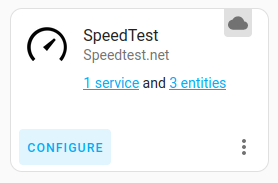
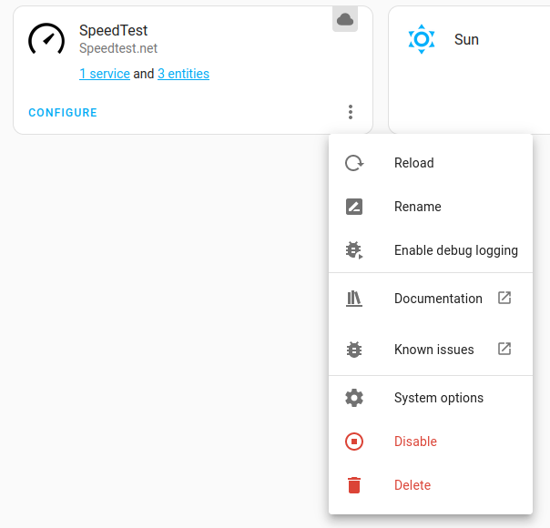
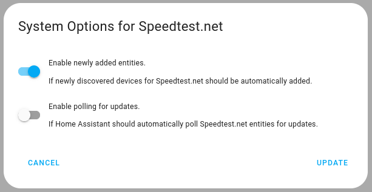
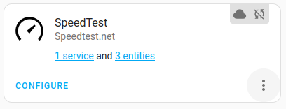

# SpeedTest Home Assistant Addon

Home Assistant has a native [integration with Speedtest.net](https://www.home-assistant.io/integrations/speedtestdotnet/). However, it uses a third-party speedtest implementation in python that may not produce accurate measures. This addon aims to integrate the [official speedtest binary](https://www.speedtest.net/apps/cli) with Home Assistant to mitigate this problem.

There have been previous attempts to do this, but imply the installation of custom scripts and the `speedtest-cli` directly into the operating system. This project overcomes this issue by creating an add-on that doesn't imply any modification in the underlying system.

## Installation
1. Install the [official speedtest integration](https://www.home-assistant.io/integrations/speedtestdotnet/)
2. Disable automatic runs of this integration
	1. Go to the `integrations` page of your Home Assistant instance and click in `CONFIGURE` in the SpeedTest integration.

		

	2. Click on the three dots the SpeedTest integration card.
	3. Click on `System options`.

		
	4. Disable the automatic execution of this integration by ensuring that `Enable polling for updates` is disabled.

		
		> If you don't see this option ensure that your HomeAssistant is updated and you have refreshed your page after installing the SpeedTest integration.

	5. You should see the SpeedTest integration card with a symbol on the top right that indicates that polling is disabled.

		

3. Click the Home Assistant My button below to open the add-on on your Home Assistant instance.

4. Add this addon repository to your addon store.
	* Click on the 3 dots button on the top right of your Addon store
	* Click on **Repositories**
	* You'll see a prompt called "Manage add-on repositories", you should put your repository's url (https://github.com/MrSuicideParrot/hassio-speedtest-addon) in the field **Add**.
5. Install the SpeedTest addon.
6. Create an automation that runs this addon as often as you want. Use the action service `hassio.addon_start` to start the addon `6b87c29e_speedtest_addon`.

## Configuration

Example basic add-on configuration:
```yaml
accept_eula: true
accept_rgpd: true
```

In this case, the addon would choose a random SpeedTest server each time it runs. It is recommended to specify a `server_id`  to have comparable measurements. The `server_id`is an integrer. 

You can run this add-on with following the configuration to see in the addon log which servers are the closest to you:

```yaml
accept_eula: true
accept_rgpd: true
print_closest_servers: true
```

After that, you should remove the `print_closest_servers` and add the `server_id` with the id of your choice.

An example of a configuration with a configured `server_id` is:
```yaml
accept_eula: true
accept_rgpd: true
server_id: 48096
```

> Alternatively, you can use this command to identify servers that are close to you: `curl https://c.speedtest.net/speedtest-servers-static.php`. The `server_id` is called `id` in the returned XML table.  (If you access this link with your web browser instead of using curl, please have in mind that it doesn't respond an html page, but rather a xml table. You can see the results by view the source-code of the page.)


## Licensing

To use this addon you must accept the SpeedTest's End User License Agreement, Terms of Use and Privacy Policy. They are available at these links:
. https://www.speedtest.net/about/eula
. https://www.speedtest.net/about/terms
. https://www.speedtest.net/about/privacy

After reading these policies you could accept them by turning on the `accept_eula` and `accept_rgpd` in the addon's configuration tab.

